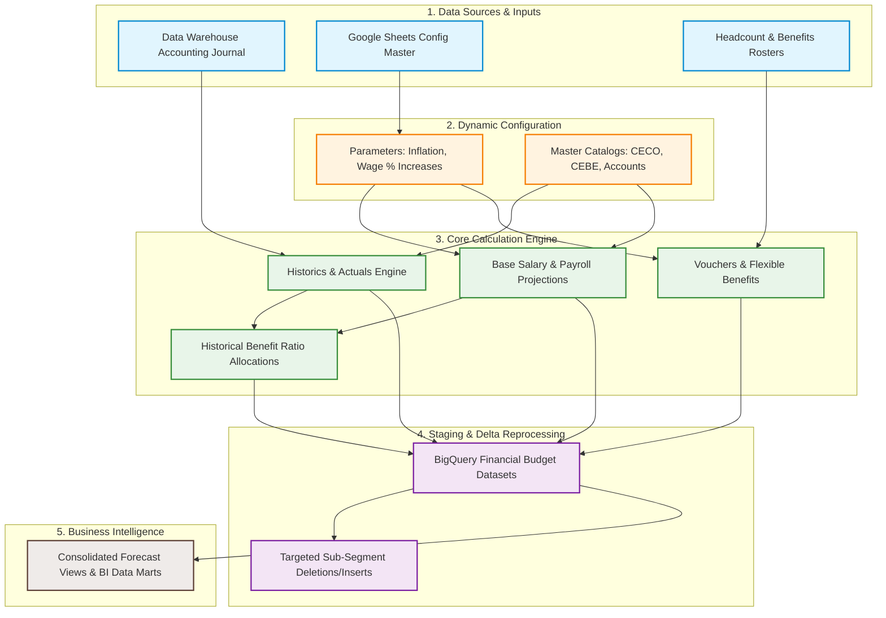

# GCP_devs
cloud-native-data-pipeline-template

```mermaid
flowchart TD
    classDef source fill:#e1f5fe,stroke:#0288d1,stroke-width:2px;
    classDef param fill:#fff3e0,stroke:#f57c00,stroke-width:2px;
    classDef engine fill:#e8f5e9,stroke:#388e3c,stroke-width:2px;
    classDef storage fill:#f3e5f5,stroke:#7b1fa2,stroke-width:2px;
    classDef output fill:#efebe9,stroke:#5d4037,stroke-width:2px;

    subgraph Inputs["1. Data Sources & Inputs"]
        A1[Data Warehouse Accounting Journal]:::source
        A2[Google Sheets Config Master]:::source
        A3[Headcount & Benefits Rosters]:::source
    end

    subgraph Config["2. Dynamic Configuration"]
        B1[Parameters: Inflation, Wage % Increases]:::param
        B2[Master Catalogs: CECO, CEBE, Accounts]:::param
    end

    subgraph Processing["3. Core Calculation Engine"]
        C1[Historics & Actuals Engine]:::engine
        C2[Base Salary & Payroll Projections]:::engine
        C3[Vouchers & Flexible Benefits]:::engine
        C4[Historical Benefit Ratio Allocations]:::engine
    end

    subgraph Storage["4. Staging & Delta Reprocessing"]
        D1[Targeted Sub-Segment Deletions/Inserts]:::storage
        D2[BigQuery Financial Budget Datasets]:::storage
    end

    subgraph BI["5. Business Intelligence"]
        E1[Consolidated Forecast Views & BI Data Marts]:::output
    end

    A1 --> C1
    A2 --> B1
    A3 --> C3
    B1 --> C2
    B1 --> C3
    B2 --> C1
    B2 --> C2
    C1 --> C4
    C2 --> C4
    C1 --> D2
    C2 --> D2
    C3 --> D2
    C4 --> D2
    D2 --> D1
    D2 --> E1
```
